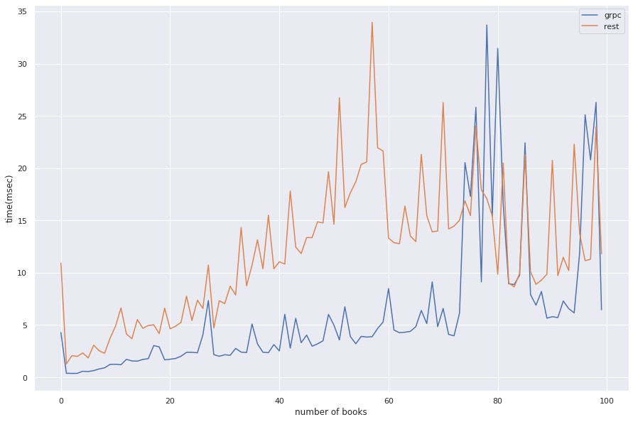
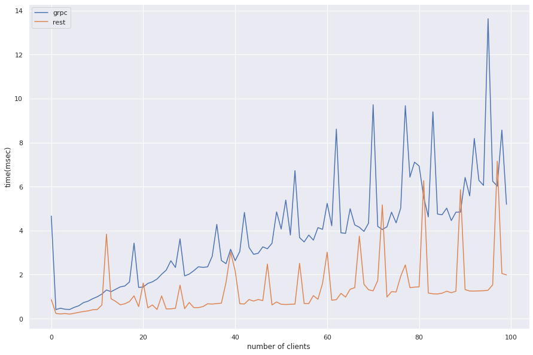
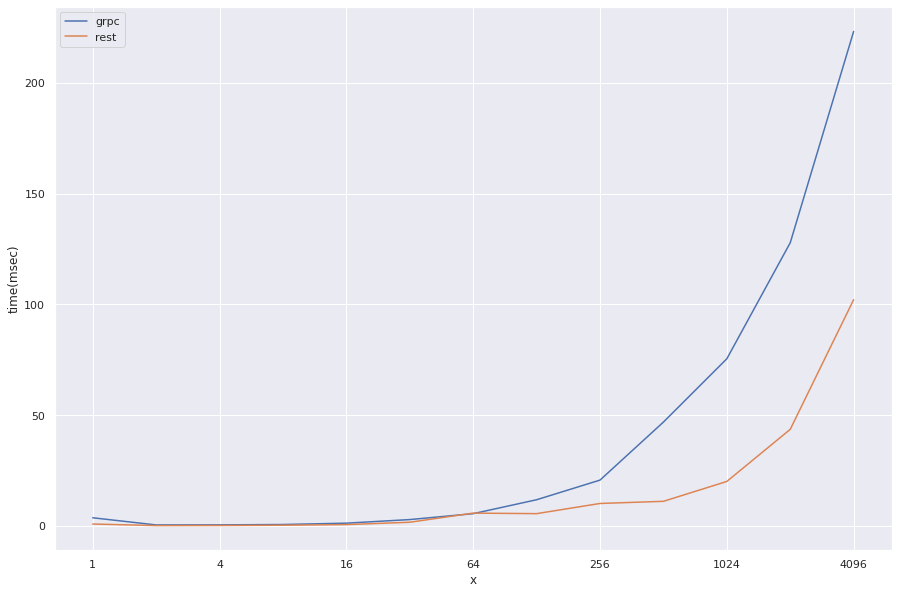
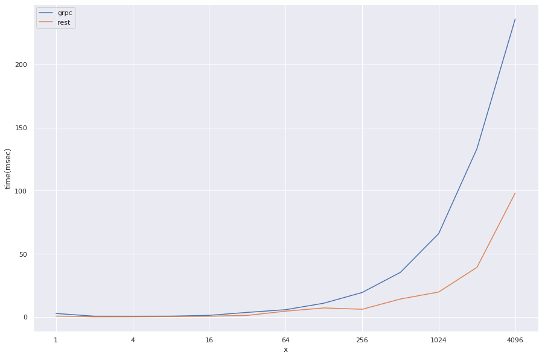

# software-aargh

## Members

Boonyawee Kiatsilp 6031034121
 Pichaya Karawawattana 6031042121
 Pimkunut Theerathitayangkul 6031043821
 Romnalin Kitkasetsathaporn 6031049621
 Jinwara Janejaneprasert 6030079221
 Jiraphat Khupanit 6030087221

## Assignment 2
### Graphs showing the benchmarking results with the explanation of your experimental settings.
**Scenario A:** Single client with a small call to insert a book item, a bigger call to insert a list of multiple book items

 &nbsp;&nbsp;&nbsp;&nbsp;&nbsp;จาก Scenario A แสดงให้เห็นว่ามีการทำงานแบบ Sequential กัน โดยมีการ insert หนังสือตั้งแต่ 1 เล่มถึง 100 เล่ม และมีการทดลองจับเวลา จากกราฟสามารถสรุปได้ว่าเมื่อเปรียบเทียบ performance กันจะเห็นได้ว่า gRPC มี performance ดีกว่า เนื่องจากใช้เวลาน้อยกว่า REST API

**Scenario B:** Multiple clients with different kind of calls

 &nbsp;&nbsp;&nbsp;&nbsp;&nbsp;จาก Scenario B แสดงให้เห็นว่ามีการทำงานแบบ Concurrent กัน โดยมีการ random call จากหลาย ๆ client โดยใน random call มี service ทั้งหมด ดังนี้ get, list, insert และ delete ซึ่งในการทดลองนี้มี client ตั้งแต่ 1 คนถึง 100 คน และมีการทดลองจับเวลา จากกราฟสามารถสรุปได้ว่าเมื่อเปรียบเทียบ performance กันจะเห็นได้ว่า REST API มี performance ดีกว่า เนื่องจากใช้เวลาน้อยกว่า gRPC

**Scenario C (get):** Vary the number of concurrent calls from 1 to 4096 calls

**Scenario C (list):** Vary the number of concurrent calls from 1 to 4096 calls

 &nbsp;&nbsp;&nbsp;&nbsp;&nbsp; จาก Scenario C ทั้งสองรูป เราได้ทดลองกับ service get และ list แสดงให้เห็นว่ามีการทำงานแบบ Concurrent กัน โดยมีจำนวน call ตั้งแต่ 1 ถึง 4096 และมีการทดลองจับเวลา จากกราฟสามารถสรุปได้ว่าเมื่อเปรียบเทียบ performance กันจะเห็นได้ว่า REST API มี performance ดีกว่า เนื่องจากใช้เวลาน้อยกว่า gRPC

### Discussion of the results why one method is better the other in which scenarios.
 &nbsp;&nbsp;&nbsp;&nbsp;&nbsp;จากผลการทดลองข้างต้นทั้ง 3 Scenaio จะเห็นได้ว่าเมื่อเป็นการทำงานแบบ Sequential gRPC ใช้เวลาในการทำงานน้อยกว่า REST API ในขณะที่เป็นการทำงานแบบ concurrent REST API จะใช้เวลาทำงานน้อยกว่า gRPC เนื่องจาก REST API สนับสนุนเฉพาะ request-response model ที่มีอยู่ใน HTTP 1.x. แต่ gRPC ใช้ประโยชน์จากความสามารถของ HTTP / 2 อย่างเต็มที่และทำให้สามารถ stream ข้อมูลได้ตลอดเวลา
### Comparison of the gRPC and REST API from the aspects of language neutral, ease of use, and performance.
**Language neutral**
 &nbsp;&nbsp;&nbsp;&nbsp;&nbsp;ทั้ง gRPC และ REST API มี language neutral ที่เหมือนกัน และเนื่องจากในกรณีนี้ใช้ภาษา JavaScript ในการ implement ทั้งคู่ จึงทำให้ไม่มีผลกระทบของความต่างทางภาษามากนัก แต่โดยปกติแล้ว ทั้ง gRPC และ REST API สามารถ implement ได้หลายภาษาขึ้นอยู่กับความเหมาะสมต่างๆ

**Ease of use**
 &nbsp;&nbsp;&nbsp;&nbsp;&nbsp;REST API มีความเหมาะสมสำหรับทั้งใช้กับระบบปิดภายใน และระบบเปิดที่มีการติดต่อสื่อสารหรือมีการเปิดเผยทรัพยากรภายในกับภายนอก ในขณะที่ gRPC ยังขาดคุณคุณสมบัติบางส่วน ทำให้เหมาะสมกับการใช้งานภายในระบบปิดที่ไม่ยุ่งเกี่ยวกับภายนอก ทำให้โดยทั่วไปแล้ว REST API จะมีความนิยมมากกว่า gRPC แต่ด้วยความที่ gRPC จะเรียกใช้ procedure จาก server ที่ทำงานอยู่โดยตรง แทนที่จะส่ง Request ด้วย HTTP Protocol เพื่อให้ server ทำงาน อย่าง REST API ทำให้ gRPC implement ได้ง่ายกว่า ซึ่งทั้งนี้อาจขึ้นอยู่กับความสามารถของ developer และสภาพแวดล้อมอื่นๆ

**Performance**
 &nbsp;&nbsp;&nbsp;&nbsp;&nbsp;จากการทดสอบในกรณีนี้แสดงให้เห็นว่า ในกรณีที่มีการเรียก call แบบ sequence จะมีประสิทธิภาพมากกว่าใน gRPC และในการเรียก call แบบ concurrent จะมีประสิทธิภาพมากกว่าใน REST API เนื่องจาก REST API สนับสนุนเฉพาะ request-response model ที่มีอยู่ใน HTTP 1.x. แต่ gRPC ใช้ประโยชน์จากความสามารถของ HTTP / 2 อย่างเต็มที่และทำให้สามารถ stream ข้อมูลได้ตลอดเวลา

### Does your results comply with the results in https://medium.com/@bimeshde/grpc-vs-rest-performance-simplified-fd35d01bbd4? How?
&nbsp;&nbsp;&nbsp;&nbsp;&nbsp;ผลลัพธ์เมื่อเปรียบเทียบผลการทดลองของกลุ่มเรากับ medium ดังกล่าว ค่อนข้างใกล้เคียงกัน ทั้งหัวข้อ performance และ ease of use เนื่องจากผลการทดลอง และสรุปผลไปในทิศทางเดียวกันที่ว่า gRPC เหมาะสำหรับ internal service และใช้ REST API ในการรองรับ external client และอื่น ๆ ที่ไม่ใช่ภายใน แต่ในส่วนของ Programming Language ที่ใช้แตกต่างกัน โดยกลุ่มของเราใช้ JavaScript ในการ implement ในขณะที่ medium ใช้ goLang
